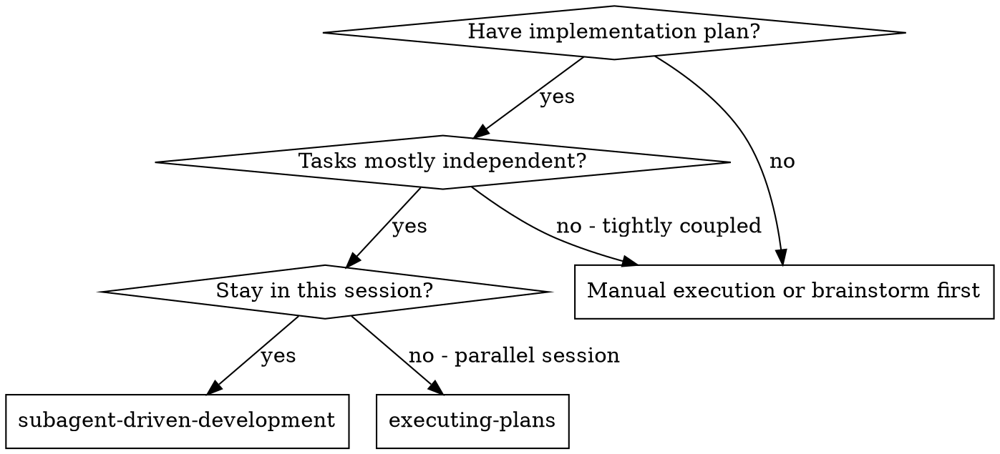
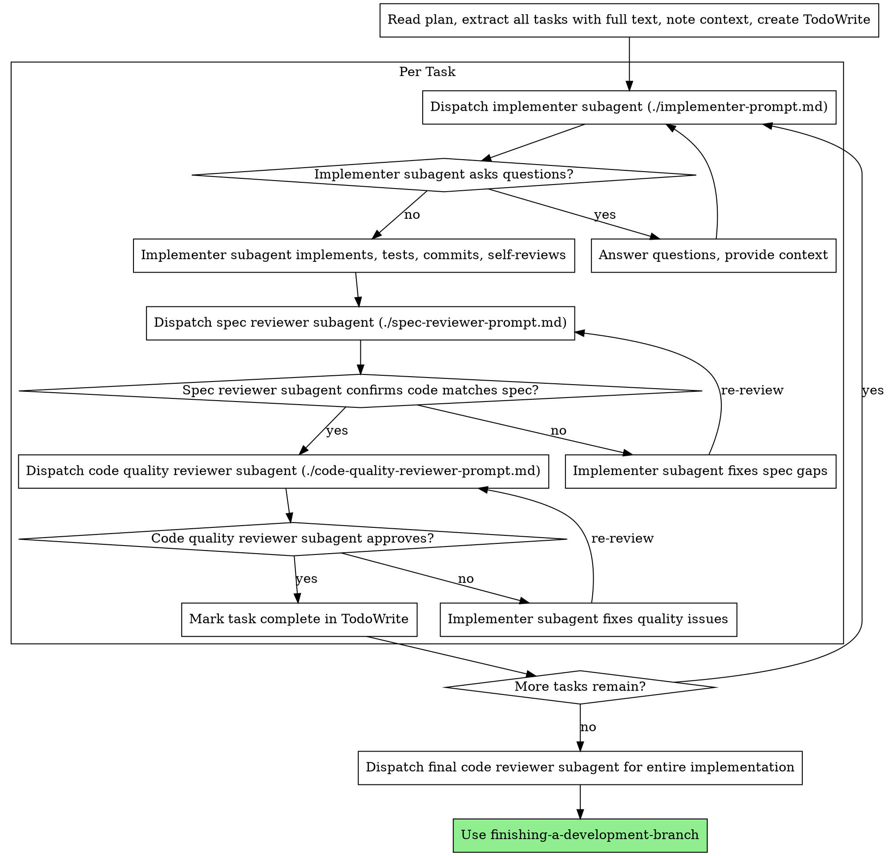

# Subagent-Driven Development

> **[Bản vendor đã điều chỉnh theo bộ luật §12 — KHÁC bản plugin]**: review theo RỦI RO thay vì sau mỗi task; MỘT lượt review gộp spec + quality (two-stage chỉ cho diff vùng đắt); loop budget tối đa 2 vòng; fix theo review = TIẾP PHIÊN implementer cũ, không respawn; reviewer KHÔNG chạy lại gate — đọc ledger `verify.md`; **song song nhiều implementer ĐƯỢC PHÉP theo luật fan-out bộ luật §11** (mỗi agent một worktree riêng + scope không giao nhau + tối đa 3) — xem mục "Parallel fan-out" bên dưới. Khi mâu thuẫn với phần dưới, bộ luật §0 thắng.

Execute plan by dispatching fresh subagent per task. Review theo tiêu chí rủi ro của bộ luật §12 (vùng đắt / contract / public API / >5 file / dependency mới) — task không chạm tiêu chí thì main tự đọc diff, không spawn reviewer.

**Why subagents:** You delegate tasks to specialized agents with isolated context. By precisely crafting their instructions and context, you ensure they stay focused and succeed at their task. They should never inherit your session's context or history — you construct exactly what they need. This also preserves your own context for coordination work.

**Core principle:** Fresh subagent per task + review đúng chỗ rủi ro + ledger verify 1 lần = high quality, fast iteration, không đốt token lặp

**Continuous execution:** Do not pause to check in with your human partner between tasks. Execute all tasks from the plan without stopping. The only reasons to stop are: BLOCKED status you cannot resolve, ambiguity that genuinely prevents progress, or all tasks complete. "Should I continue?" prompts and progress summaries waste their time — they asked you to execute the plan, so execute it.

## When to Use



**vs. Executing Plans (parallel session):**
- Same session (no context switch)
- Fresh subagent per task (no context pollution)
- Two-stage review after each task: spec compliance first, then code quality
- Faster iteration (no human-in-loop between tasks)

## The Process



## Parallel fan-out (bản vendor — theo bộ luật §11 "Fan-out song song")

Bản gốc cấm dispatch nhiều implementer song song vì conflict trong CÙNG working tree. Bản vendor NỚI CÓ ĐIỀU KIỆN — song song an toàn khi và chỉ khi đủ CẢ 4:

1. Các task ĐỘC LẬP thật: scope ghi không giao nhau · không phụ thuộc thứ tự · KHÔNG task nào đụng hot-zone (hot-zone tách riêng, chạy tuần tự) · không cùng đụng một shared feature.
2. Mỗi task đủ lớn để bù overhead worktree (task cỡ LÀM LUÔN chạy tuần tự — overhead worktree + tích hợp ăn hết lãi).
3. Mỗi implementer MỘT worktree riêng (`isolation: worktree` khi spawn / skill `cc-harness:using-git-worktrees`). cc-lock coi mỗi worktree là một clone — tự DENY nếu 2 agent lỡ đụng cùng relpath (lưới cuối, không phải giấy phép giẫm scope).
4. Tối đa 3 implementer đồng thời — quá 3, chi phí điều phối + tích hợp của controller tăng nhanh hơn tốc độ thu về.

Cách chạy: spawn các implementer trong CÙNG một message (chạy đồng thời), mỗi prompt TỰ CHỨA (full task text + scope ghi được phép + "định sửa ngoài scope ⇒ NEEDS_ADVICE"); task đụng hot-zone TÁCH ra chạy tuần tự trước/sau đợt song song; controller tích hợp lần lượt từng worktree, kiểm chồng lấn, rồi FULL GATE đúng 1 lần trên kết quả GỘP + ghi ledger; review trên DIFF GỘP theo tiêu chí rủi ro. Một nhánh bế tắc không chặn nhánh còn lại. Chia domain độc lập + viết prompt tự chứa: skill `cc-harness:dispatching-parallel-agents`.

## Model Selection

Use the least powerful model that can handle each role to conserve cost and increase speed.

**Mechanical implementation tasks** (isolated functions, clear specs, 1-2 files): use a fast, cheap model. Most implementation tasks are mechanical when the plan is well-specified.

**Integration and judgment tasks** (multi-file coordination, pattern matching, debugging): use a standard model.

**Architecture, design, and review tasks**: use the most capable available model.

**Task complexity signals:**
- Touches 1-2 files with a complete spec → cheap model
- Touches multiple files with integration concerns → standard model
- Requires design judgment or broad codebase understanding → most capable model

## Handling Implementer Status

Implementer subagents report one of four statuses. Handle each appropriately:

**DONE:** Proceed to spec compliance review.

**DONE_WITH_CONCERNS:** The implementer completed the work but flagged doubts. Read the concerns before proceeding. If the concerns are about correctness or scope, address them before review. If they're observations (e.g., "this file is getting large"), note them and proceed to review.

**NEEDS_CONTEXT:** The implementer needs information that wasn't provided. Provide the missing context and re-dispatch.

**BLOCKED:** The implementer cannot complete the task. Assess the blocker:
1. If it's a context problem, provide more context and re-dispatch with the same model
2. If the task requires more reasoning, re-dispatch with a more capable model
3. If the task is too large, break it into smaller pieces
4. If the plan itself is wrong, escalate to the human

**Never** ignore an escalation or force the same model to retry without changes. If the implementer said it's stuck, something needs to change.

## Prompt Templates

- `./implementer-prompt.md` - Dispatch implementer subagent
- `./spec-reviewer-prompt.md` - Dispatch spec compliance reviewer subagent
- `./code-quality-reviewer-prompt.md` - Dispatch code quality reviewer subagent

## Example Workflow

```
You: I'm using Subagent-Driven Development to execute this plan.

[Đọc danh sách item một lần: tasks_list / docs/wip/<lô>/plan.md khi tắt]
[Extract all 5 tasks with full text and context]
[Create TodoWrite with all tasks]

Task 1: Hook installation script

[Get Task 1 text and context (already extracted)]
[Dispatch implementation subagent with full task text + context]

Implementer: "Before I begin - should the hook be installed at user or system level?"

You: "User level (~/.config/superpowers/hooks/)"

Implementer: "Got it. Implementing now..."
[Later] Implementer:
  - Implemented install-hook command
  - Added tests, 5/5 passing
  - Self-review: Found I missed --force flag, added it
  - Committed

[Dispatch spec compliance reviewer]
Spec reviewer: ✅ Spec compliant - all requirements met, nothing extra

[Get git SHAs, dispatch code quality reviewer]
Code reviewer: Strengths: Good test coverage, clean. Issues: None. Approved.

[Mark Task 1 complete]

Task 2: Recovery modes

[Get Task 2 text and context (already extracted)]
[Dispatch implementation subagent with full task text + context]

Implementer: [No questions, proceeds]
Implementer:
  - Added verify/repair modes
  - 8/8 tests passing
  - Self-review: All good
  - Committed

[Dispatch spec compliance reviewer]
Spec reviewer: ❌ Issues:
  - Missing: Progress reporting (spec says "report every 100 items")
  - Extra: Added --json flag (not requested)

[Implementer fixes issues]
Implementer: Removed --json flag, added progress reporting

[Spec reviewer reviews again]
Spec reviewer: ✅ Spec compliant now

[Dispatch code quality reviewer]
Code reviewer: Strengths: Solid. Issues (Important): Magic number (100)

[Implementer fixes]
Implementer: Extracted PROGRESS_INTERVAL constant

[Code reviewer reviews again]
Code reviewer: ✅ Approved

[Mark Task 2 complete]

...

[After all tasks]
[Dispatch final code-reviewer]
Final reviewer: All requirements met, ready to merge

Done!
```

## Advantages

**vs. Manual execution:**
- Subagents follow TDD naturally
- Fresh context per task (no confusion)
- Parallel-safe (subagents don't interfere)
- Subagent can ask questions (before AND during work)

**vs. Executing Plans:**
- Same session (no handoff)
- Continuous progress (no waiting)
- Review checkpoints automatic

**Efficiency gains:**
- No file reading overhead (controller provides full text)
- Controller curates exactly what context is needed
- Subagent gets complete information upfront
- Questions surfaced before work begins (not after)

**Quality gates:**
- Self-review catches issues before handoff
- Two-stage review: spec compliance, then code quality
- Review loops ensure fixes actually work
- Spec compliance prevents over/under-building
- Code quality ensures implementation is well-built

**Cost:**
- More subagent invocations (implementer + 2 reviewers per task)
- Controller does more prep work (extracting all tasks upfront)
- Review loops add iterations
- But catches issues early (cheaper than debugging later)

## Red Flags

**Never:**
- Start implementation on main/master branch without explicit user consent
- Skip review khi diff chạm tiêu chí rủi ro bộ luật §12 (vùng đắt/contract/public API/>5 file/dep mới)
- Proceed with unfixed issues
- Dispatch multiple implementation subagents in parallel **trong cùng working tree** (conflicts) — song song CHỈ theo luật fan-out (mục "Parallel fan-out": worktree riêng + scope không giao nhau + ≤ 3 agents)
- Make subagent read plan file (provide full text instead)
- Skip scene-setting context (subagent needs to understand where task fits)
- Ignore subagent questions (answer before letting them proceed)
- Accept "close enough" on spec compliance (reviewer found issues = not done)
- Skip re-review khi đã có issues (trong budget 2 vòng — bộ luật §12)
- Let implementer self-review replace actual review (khi diff thuộc diện phải review)
- Move to next task while review has open issues

**If subagent asks questions:**
- Answer clearly and completely
- Provide additional context if needed
- Don't rush them into implementation

**If reviewer finds issues:**
- Implementer (same subagent — SendMessage tiếp phiên, KHÔNG respawn) fixes them
- Reviewer reviews again — **tối đa 2 vòng/task**; vòng 3 ⇒ DỪNG, trình user quyết (bộ luật §12)
- Đừng bỏ re-review khi đã có issues, nhưng cũng đừng lặp quá budget

**If subagent fails task:**
- Dispatch fix subagent with specific instructions
- Don't try to fix manually (context pollution)

## Integration

**Required workflow skills:**
- **using-git-worktrees** - Ensures isolated workspace (creates one or verifies existing)
- **writing-plans** - Creates the plan this skill executes
- **requesting-code-review** - Code review template for reviewer subagents
- **finishing-a-development-branch** - Complete development after all tasks

**Subagents should use:**
- **test-driven-development** - Subagents follow TDD for each task

**Alternative workflow:**
- **executing-plans** - Use for parallel session instead of same-session execution
